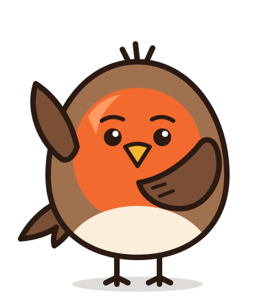

  

<h1 align="center">Honest Robin</h1>

<i>A joy to use. Honest. You come first.</i>

  Open-source tools for small teams. Most software gets worse after you move in. We're building
  ours to change that. More at <a href="https://honestrobin.com"><b>honestrobin.com</b></a>, including
  the <a href="https://honestrobin.com/code">Robin's Code</a>: the promises every product has to
  keep.

**A joy to use.** A lot of work software became awful to use. We want it to be a joy again: tools
that stay out of your way and have no opinion on how you do your work. **Honest.** We don't lie
to you and we don't trick you. Ask us a straight question and you get a straight answer. **You come first.** When what's good for us and what's good for you are not the same, we
pick you.

## Products

| | What | Where it stands |
|---|---|---|
| **[Time](https://github.com/honestrobin/time)** | Time tracking and invoicing for freelancers and agencies, with e-invoicing built in and an importer for Harvest | Version 1 built, not released yet. Run it yourself with Docker |
| **Credits** | Credits and usage limits for people who sell AI products | A specification so far, with no product code |

## Built by Claude

The code, tests and docs are written by Claude, Anthropic's AI, with many agents working at the
same time. Marko Kruljac writes the specification, knows the architecture and decides what gets
built. Every commit Claude wrote says so, and every decision someone might question is written
down with its reasoning.

Before a release the maintainer will test the product and review samples of the code, and AI
agents make most of the corrections. That review isn't done yet, and neither is an independent
security audit, so treat Time as pre-release software.

## Say hello

[hello@honestrobin.com](mailto:hello@honestrobin.com). If you find something wrong, open an issue
or write to us.

Claude and Anthropic are trademarks of Anthropic. Honest Robin isn't affiliated with or endorsed by Anthropic.
